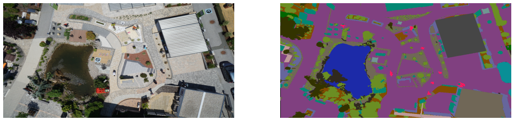

# Aerial Semantic Segmentation Drone Dataset Using U-Net

## Project abandoned due to lack of training data. Please see the follow up project on agriculture anomaly detection using aerial image segmentation 

* Dataset - https://www.kaggle.com/bulentsiyah/semantic-drone-dataset

### Example Training point

